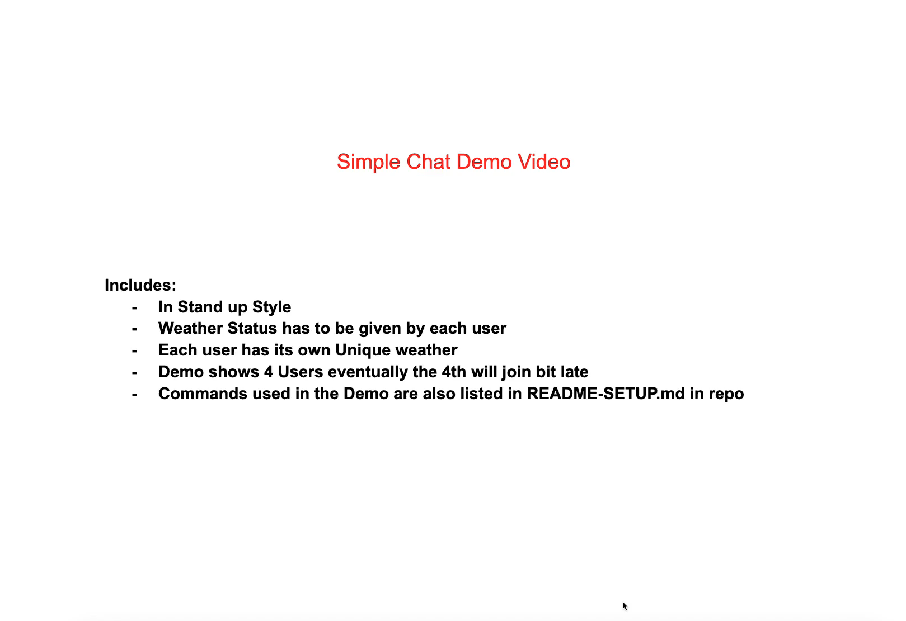

## Asynchronous Chat System

[](https://github.com/rsachdeva/simple-chat/actions/workflows/rust.yml)

## Table of Contents

- [Demo](#demo)
- [Overview](#overview)
    - [Server Architecture](#server-architecture)
    - [Client Features](#client-features)
- [Running Server and Client](#running-server-and-client)
- [Configurations](#configurations)
- [Running Tests](#running-tests)
- [Git Hooks Setup](#git-hooks-setup)
- [GitHub Workflow](#github-workflow)
- [Clean And Build](#clean-and-build)
- [Summary of the Responsibilities for crate chatty-types and chatty-tcp in Workspace](#summary-of-the-responsibilities-for-crate-chatty-types-and-chatty-tcp-in-workspace)
- [Domain Driven Terminology](#domain-driven-terminology)

### Demo

Options to view the demo:

1. **Watch in Browser**: You can watch the video online.

- [](https://vimeo.com/1042383973)


2. **Download the Video**: You can download the video directly to your device.

- [Download Demo with Weather-Standup](demo/Weather-Standup.mp4)

### Overview

A high-performance asynchronous chat system consisting of a server and CLI client implementation, designed for maximum
throughput and concurrency.

#### Server Architecture

Manages a single chat room with efficient user handling
Processes incoming messages through non-blocking operations
Broadcasts messages to all connected users except the sender
Handles user join/leave operations seamlessly
Maintains unique usernames across the system
Optimized for high throughput with minimal memory footprint
Implements automatic cleanup on user disconnection

#### Client Features

Features an async CLI interface
Connects automatically to the server on startup
Configurable through environment variables or command line arguments for:

- Host address
- Port
- Username

Provides an interactive command prompt supporting:

- send <MSG> for message broadcasting
- leave for graceful disconnection

### Running Server and Client

To run the server and client, use the following commands:

```shell
just run-chatty-tcp-server
```

And for 3 clients:

```shell
just run-chatty-tcp-client-carl-join
```

This passes the username carl as an argument to the client.
And similarly for other clients:

```shell
just run-chatty-tcp-client-david-join
```

```shell
just run-chatty-tcp-client-lucio-join
```

For entering username at the prompt:

```shell
just run-chatty-tcp-client-join-no-username
```

### Configurations

The project uses custom configurations defined in `.cargo/config.toml`:

- TCP_SERVER_ADDRESS default "localhost"
- TCP_SERVER_PORT default "8081"
  These configurations are used to set the server address and port for the TCP server.
  This allows clients to connect to the server using the same address and port.

[Back to Table of Contents](#table-of-contents)

### Running Tests

##### Unit and Integration tests

`just test`

[Back to Table of Contents](#table-of-contents)

### Git Hooks Setup

This project uses git hooks to ensure code quality. To set up the pre-commit hook:

```bash
chmod +x .githooks/pre-commit
git config core.hooksPath .githooks
```

Once set up, this hook will automatically run before every commit to ensure code quality. You can also run it directly
anytime:

```bash
./.githooks/pre-commit
```

[Back to Table of Contents](#table-of-contents)

### GitHub Workflow

The project leverages GitHub Actions to validate chat server client connectivity and executes both unit and integration
tests.
The workflow is defined in `.github/workflows/rust.yml`.

[Back to Table of Contents](#table-of-contents)

### Clean And Build

```shell
just clean
```

```shell
just build
```

```shell
just build-with-tests
```

[Back to Table of Contents](#table-of-contents)

### Summary of the Responsibilities for crate chatty-types and chatty-tcp in Workspace

###### chatty-types:

* Core types and behaviors (more will be added as needed when more protocols are added, currently only TCP. However, the
  separation is done from extensibility perspective if more protocols are added)
* Shared infrastructure like tracing config

###### chatty-tcp:

* TCP-specific transport layer or tightly coupled logic with TCP for now
* Server and client implementations
* Client has:
    - Sending `command` module as part of the client
    - Processing `response` module as part of the client
    - These are part of the `connect` module used by the client.
* Server has:
    - Processing `command` module as part of the server
    - Sending `response` module as part of the server
    - These are part of the `listen` module used by the server.

Bidirectional communication between the client and server is clear based on module names.
Both have `command` and `response` modules: the client sends the commands and processes responses, while the server
processes commands and sends responses.

[Back to Table of Contents](#table-of-contents)

### Domain Driven Terminology:

The following terms are consistently used throughout the project, forming the core vocabulary of our
domain-specific language in both design and development:

- **User**: A person who interacts with the chat application.
- **Command**: Command issued by a user to the chat application.
- **ChatMessage**: Message sent by a user in the chat application as part of Send command.
- **ChatResponse**: Response sent by the chat application.
- **ChatMemo**: Memo sent by the chat application as part of ChatResponse.

[Back to Table of Contents](#table-of-contents)
